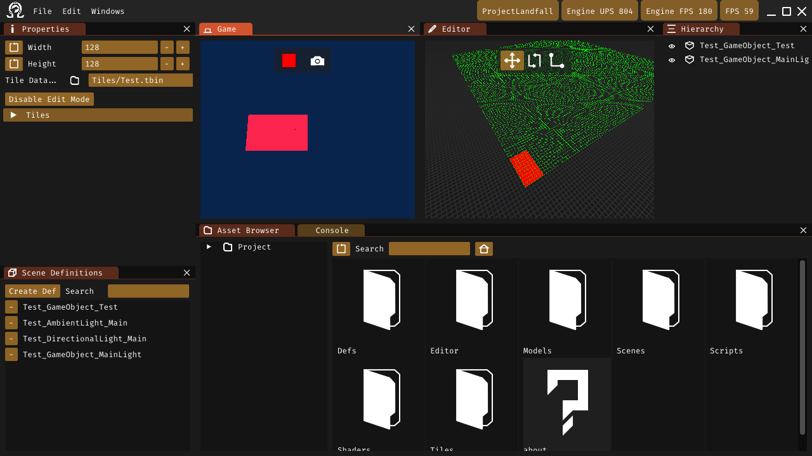

#  Icarian Editor



The editor for the Icarian Engine.

## Prerequisites
* Vulkan SDK (Validation Layers in Debug not required in Release)
* Python3 (glslang)
### Linux
* GCC, Clang or Zig (GCC primary)
* Wayland
* X11
* XOrg Client
* Pulse
* Jack
* ALSA
### Linux Steam version
* podman
### Windows
* MingGW

## Windows Support

Currently mileage may very for editor support on Windows and core functionality may be broken. Focus has been on working 1st and Windows later.

## Building

Building is done via CUBE.

Building can be done by running the following scripts.
```
./build.sh
./export.sh
./remoteBuild.sh
```

For extra options refer to --help on build.sh.

Output is in the build folder.

Windows builds are done via cross compilation with MinGW.
MSVC is currently not supported.